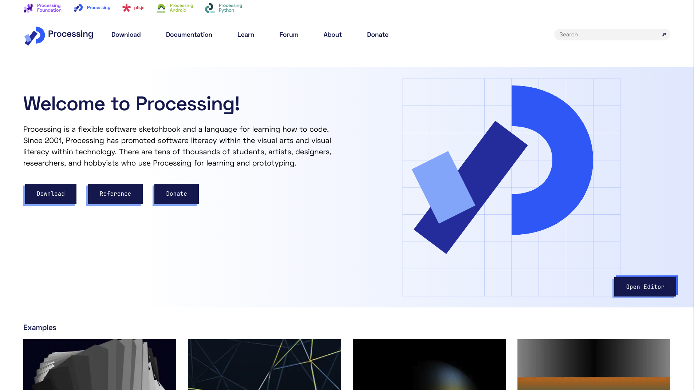
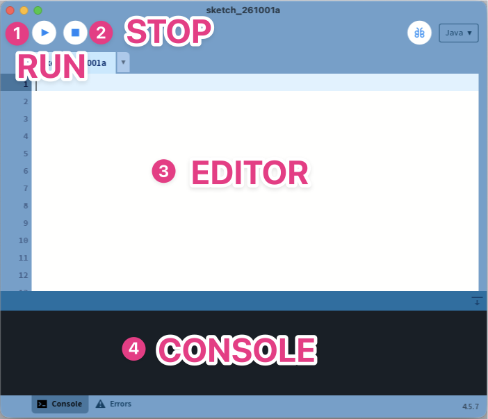
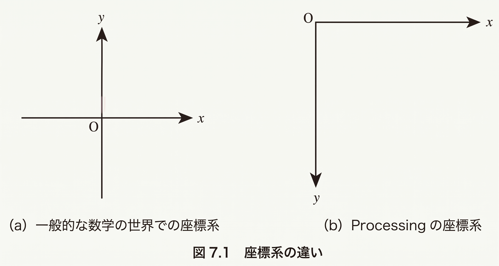
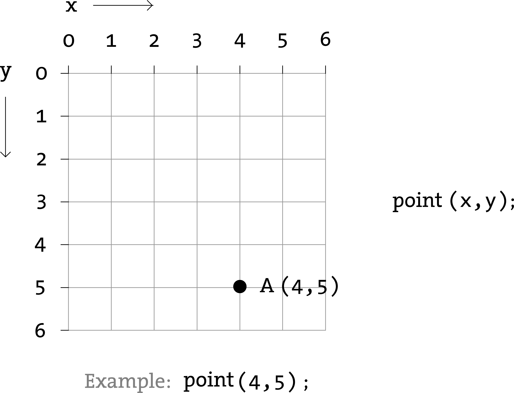
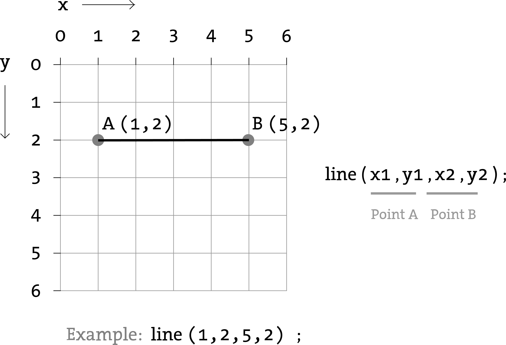
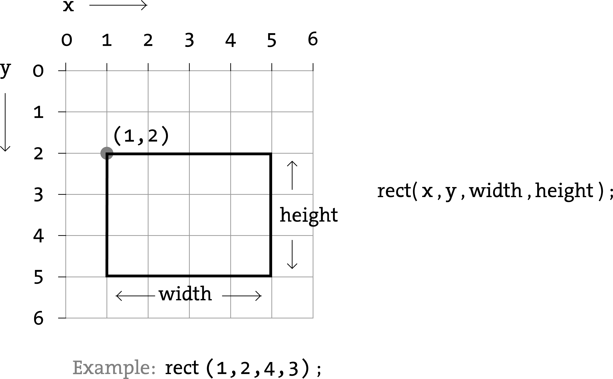
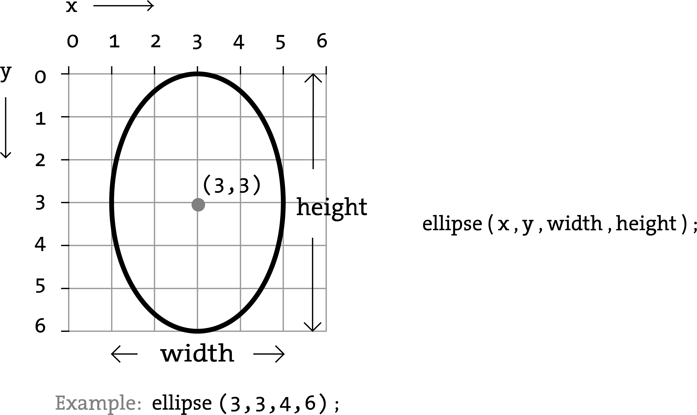
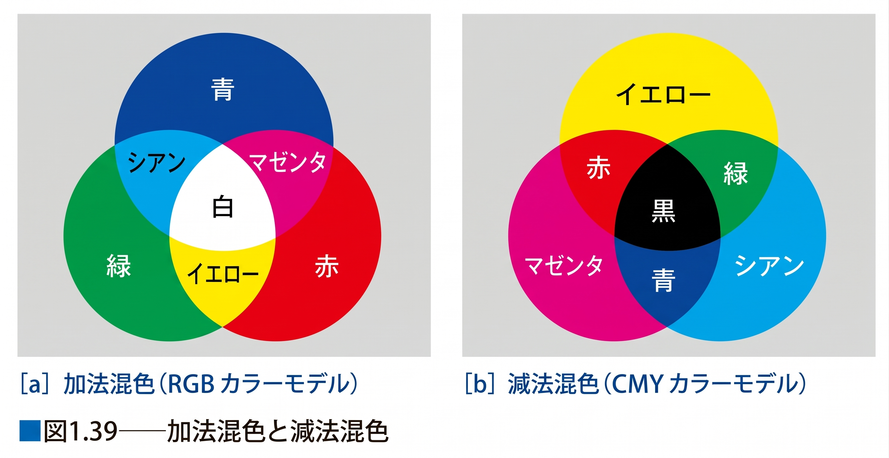
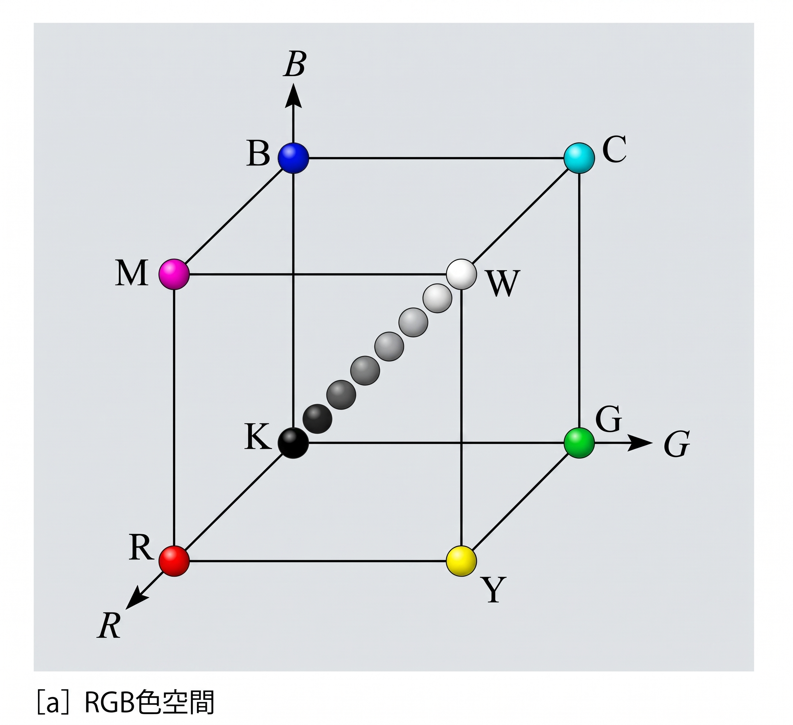
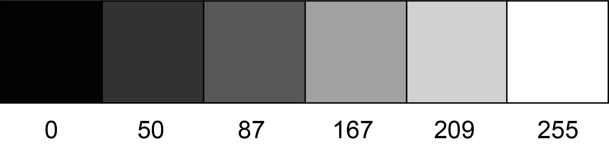

# Computer Graphics

## 第2回：Processingの基本操作と図形描画

情報学部 情報学科  情報メディア専攻
清水 哲也

---

# 今日の内容

1. [コンピュータグラフィックスとは](#sec-cg)
2. [Processingの基本操作](#sec-processing)
3. [Processing座標と基本図形](#sec-coordinate)
4. [カラー表現](#sec-color)

---

<a id="sec-cg"></a>

<!-- _class: lead -->

# 1．Computer Graphics

## コンピュータグラフィックスとは何か？

---

# Computer Graphicsとは

**Computer Graphics（CG）** とは，

> コンピュータによる計算を利用して  画像や映像を生成する技術

です．

CGでは，図形や物体を

- **数値**
- **数式**
- **アルゴリズム**

としてコンピュータ上に表現します．

---

# CGの利用分野

CGは，さまざまな分野で利用されています．

- ゲーム
- 映画・アニメーション
- VR / AR / XR
- CAD・設計
- シミュレーション
- データ可視化
- デジタルアート

---

# CGで画像を作るということ

ディスプレイに表示される画像は，

**Pixel（画素）**

と呼ばれる小さな要素の集合です．

例えば，幅(Width) $W$ pixel，高さ(Height) $H$ pixel の画像は，

$$
W\times H
$$

個のPixelから構成されます．

---

# Pixelと画像

例えば，

$$
W=1920,\qquad H=1080
$$

の場合，

$$
1920\times1080 = 2,073,600
$$

個のPixelがあります．

つまりFull HD画像は，**約207万個のPixel**によって構成されています．
これが，4K画像になると，**約829万個のPixel**によって構成されています．

---

# CGを数学的に考える

CGでは，画面上の位置を

$$
(x,y)
$$

という**座標**で表現します．

さらに3DCGでは，

$$
(x,y,z)
$$

という3つの値で位置を表現します．

つまりCGでは，**幾何学を数値としてコンピュータに与える**ことが基本になります．

---

<a id="sec-processing"></a>

<!-- _class: lead -->

# 2．Processing

## Processingの基本操作

---

# Processingとは

Processingは，**Javaをベースとしたプログラミング環境**です．

CGやGenerative Artを比較的少ないコードで実装できます．

対応OS

- Windows
- macOS
- Linux

公式サイト

https://processing.org/

---

<!-- _class: no-header no-footer -->



<!--
毎年度最新版に差し替える．
-->

---

# Processingを起動する

Processingで作成するプログラムを **Sketch（スケッチ）** と呼びます．

Sketchを書いて実行すると，

```text
Program
   ↓
Processing
   ↓
Graphics
```

という流れで画面が生成されます．

---

# Processing IDE

Processingの画面は主に次の要素から構成されます．

|  項目   |             役割             |
| ------- | ---------------------------- |
| Editor  | プログラムを書く             |
| Run     | Sketchを実行する             |
| Stop    | 実行を停止する               |
| Console | メッセージやエラーを表示する |

---

# Processing IDE



---

# Sketchの保存

Sketchを保存すると，

```text
sketch_ex01/
    └── sketch_ex01.pde
```

のように， **Sketch名と同じ名前のフォルダ** が作成されます．

### 授業での推奨

- ファイル名は半角英数字を使用
- 先頭はアルファベット
- 授業用の作業フォルダを作成する

---

# 最初のProcessingプログラム

```java
size(500, 500);
point(50, 50);
line(80, 40, 400, 450);
rect(100, 150, 300, 100);
ellipse(250, 300, 200, 250);
```

Processingでは，基本的に **上から下へ順番に命令が実行されます．**

---

# プログラムと画像

プログラム

```java
rect(100, 150, 300, 100);
```

は，

> 座標 $(100,150)$ を基準として，幅300，高さ100の長方形を描く

という意味になります．

つまり，

### コード ⇔ 幾何学的情報

が対応しています．

---

<a id="sec-coordinate"></a>

<!-- _class: lead -->

# 3．Coordinate & Geometry

## Processing座標と基本図形

---

# Processingの座標系

Processingでは，画面左上が原点

$$
(0,0)
$$

です．

- 右方向：$+x$
- 下方向：$+y$

となります．

---

<!-- _class: no-footer -->

# 一般的な数学の座標系とProcessingの座標系



<p class="note">出展:ProceesingによるCGとメディアアート, 著者：近藤邦雄，田所淳</p>

---

# 数学の座標系との違い

数学でよく使う直交座標系では，

- 右方向：$+x$
- <span class="red-bold">上方向：$+y$</span>

です．

一方，Processingでは

- 右方向：$+x$
- <span class="red-bold">下方向：$+y$</span>

です．

---

# なぜY軸が下向きなのか

コンピュータ画面では，画面左上から

```text
1行目
2行目
3行目
...
```

とPixelを並べる考え方が使われてきました．

そのため，

**下へ移動するとY座標が増える**

座標系が一般的です．

---

# 点を数学的に表す

画面上の点 $P$ は，

$$
P=(x,y)
$$

として表現できます．

数学的（ベクトル）に表すと以下の様になります．

$$
\mathbf{p} =
\begin{pmatrix}
x\\
y
\end{pmatrix}
$$

Processingでは，

```java
point(x, y);
```

によって点を描きます．

---

# 点の例

例えば，

```java
point(100, 150);
```

は，

$$
\mathbf{p}
=
\begin{pmatrix}
100\\
150
\end{pmatrix}
$$

という位置に点を描いていると考えられます．

---

# `point()`(点の描画)



---

# 直線を描く

Processingでは，

```java
line(x1, y1, x2, y2);
```

によって2点を結ぶ線分を描きます．

始点 : $P_0=(x_1,y_1)$

終点 : $P_1=(x_2,y_2)$

を指定します．

---

# `line()`(線の描画)



---

# 線分を数学的に考える

2点

$$
\mathbf{p}_0,\mathbf{p}_1
$$

を結ぶ線分上の点は，

$$
\mathbf{p}(t) = (1-t) \mathbf{p}_0 + t \mathbf{p}_1
$$

と表せます．

ここで，

$$
0\leq t\leq1
$$

です．

---

# 線分上の位置

$$
\mathbf{p}(t) = (1-t) \mathbf{p}_0 + t \mathbf{p}_1
$$

において，

|  $t$   | 位置 |
| -----: | ---- |
|    $0$ | 始点 |
|  $0.5$ | 中点 |
|    $1$ | 終点 |

となります．

この考え方は後の **アニメーションや補間** でも重要になります．

---

# 長方形を描く

```java
rect(x, y, width, height);
```

では，

左上 : $(x,y)$

と，

- 幅 $w$
- 高さ $h$

を指定します．

---

# 長方形を領域として考える

左上を $(x_0,y_0)$ とすると，長方形内部の点 $(x,y)$ は，

$$
x_0\leq x\leq x_0+w
$$

$$
y_0\leq y\leq y_0+h
$$

を満たします．

CGでは，図形を **座標が満たす条件** として表現することもできます．

---

<!-- _class: no-footer -->

# `rect()`(Rectangle)



---

# 楕円を描く

Processingでは，

```java
ellipse(cx, cy, width, height);
```

を使います．

中心

$$
(c_x,c_y)
$$

幅 $w$，高さ $h$ の楕円を描きます．

---

<!--- _class: no-footer -->

# `ellipse()`(楕円・円の描画)



---

# 楕円の方程式

楕円の半径を

$$
a=\frac{w}{2},
\qquad
b=\frac{h}{2}
$$

とすると，

$$
\frac{(x-c_x)^2}{a^2}
+
\frac{(y-c_y)^2}{b^2}
=1
$$

で表されます．

---

# 円は楕円の特殊な場合

もし，

$$
a=b=r
$$

なら，

$$
(x-c_x)^2+(y-c_y)^2=r^2
$$

となります．

これは中心

$$
(c_x,c_y)
$$

半径 $r$ の**円の方程式**です．

---

# 基本図形

|  図形  |       Processing       |
| ------ | ---------------------- |
| 点     | `point(x, y)`          |
| 線     | `line(x1, y1, x2, y2)` |
| 長方形 | `rect(x, y, w, h)`     |
| 楕円   | `ellipse(x, y, w, h)`  |
| 三角形 | `triangle(...)`        |
| 四角形 | `quad(...)`            |

---

# 三角形

3点

$$
P_1=(x_1,y_1)
$$

$$
P_2=(x_2,y_2)
$$

$$
P_3=(x_3,y_3)
$$

を指定します．

```java
triangle(
  x1, y1,
  x2, y2,
  x3, y3
);
```

つまり三角形は， **3つの頂点の集合** として定義できます．

---

# 四角形

四角形も同様に，

$$
P_1,P_2,P_3,P_4
$$

の4頂点を指定します．

```java
quad(
  x1, y1,
  x2, y2,
  x3, y3,
  x4, y4
);
```

後の3DCGでは， **Vertex（頂点）** という考え方が非常に重要になります．

---

# 例題1｜基本図形

```java
size(500, 500); // キャンバスサイズを500px x 500pxに設定
point(50, 50); // 点の描画
line(80, 40, 400, 450); // 線の描画
rect(100, 150, 300, 100); // 四角形の描画
ellipse(250, 300, 200, 250); // 楕円の描画
```

実行して，それぞれの図形と座標の関係を確認してください．

---

# 描画順序

Processingでは，

```java
rect(...);
ellipse(...);
```

と書いた場合，

1. 長方形を描く
2. 楕円を描く

という順番になります．

後から描いた図形が，**先に描いた図形の上に描画されます．**

---

# 描画順序を変えると？

### A

```java
rect(...);
ellipse(...);
```

### B

```java
ellipse(...);
rect(...);
```

AとBでは，

**重なっている部分の見え方が変わります．**

<!--
画像提案：
同じ四角形と円を，
描画順だけ変更した2枚の結果を左右に比較する．
-->

---

# 演習1

次の図形を描いてください．

1. 画面サイズ：$600\times600$
2. 中心：$(300,300)$
3. 直径400の円
4. 円の中心を通る水平線
5. 円の中心を通る垂直線

### 考えること

円と線を描く順番を変えると，画面はどのように変化するでしょうか？

---

<a id="sec-color"></a>

<!-- _class: lead -->

# 4．Color

## コンピュータにおける色

---

# RGB Color

ディスプレイでは，

光の三原色

- Red
- Green
- Blue

を組み合わせて色を表現します．

これを **RGB加法混色** と呼びます．

---

<!-- _class: no-footer -->

# 加法混色と加法減色



<p class="note">
出展：ビジュアル情報処理 -CG・画像処理入門- [改訂新版] CG-ARTS協会
</p>

---

# RGBを数学的に表す

色も3つの値を持つため，ベクトルとして

$$
\mathbf{c} =
\begin{pmatrix}
R\\
G\\
B
\end{pmatrix}
$$

と考えることができます．

例えば赤は，

$$
\mathbf{c} =
\begin{pmatrix}
255\\
0\\
0
\end{pmatrix}
$$

です．

---

# RGB Color Space

RGBをそれぞれ座標軸と考えると，色は **3次元空間の1点** として表現できます．

$$
(R,G,B)
$$

例えば，

- Black：$(0,0,0)$
- Red：$(255,0,0)$
- White：$(255,255,255)$

です．

---

<!-- _class: no-footer -->




<p class="note">
出展：ビジュアル情報処理 -CG・画像処理入門- [改訂新版] CG-ARTS協会
</p>

---

# 8 bit Color

Processingでは通常，

$$
0\leq R,G,B\leq255
$$

として色を指定します．

1つの色成分には

$$
256=2^8
$$

段階あります．

つまり， **1成分 = 8 bit** です．

---

# 24 bit Color

RGBそれぞれが8 bitなので，

$$
8+8+8=24\ \mathrm{bit}
$$

です．

表現できる色数は，

$$
256^3
=
2^{24}
=
16,777,216
$$

色です．

一般に **24 bit True Color** と呼ばれます．

---

# Grayscale

RGBの値をすべて同じにすると，

$$
R=G=B
$$

グレースケールになります．

例えば，

$$
Black = (0,0,0)_{RGB} = (0)_{GrayScale}
$$

$$
White = (255,255,255)_{RGB} = (255)_{GrayScale}
$$

Processingでは，

```java
fill(128);
```

のように1つの値だけでも指定できます．

---

# Grayscale



---

# 色を指定する関数

### 背景色の指定

```java
background(r, g, b);
```

### 線の色の指定

```java
stroke(r, g, b);
```

### 塗りの色を指定

```java
fill(r, g, b);
```

---

# 描画しない

### 塗りつぶさない

```java
noFill();
```

### 線を描かない

```java
noStroke();
```

図形そのものだけでなく，**輪郭と内部を別々に制御**できます．

---

# 例題2｜Color

```java
size(500, 500); // キャンバスサイズを500px x 500pxに指定

background(202); // 背景色に指定

stroke(39, 44, 155); // 線の色を赤:39, 緑:44, 青:155に指定
fill(77, 155, 39); // 塗りつぶしの色を赤:77, 緑:155, 青:39に指定

point(50, 50); // 点の描画
line(80, 40, 400, 450); // 線の描画
rect(100, 150, 300, 100); // 長方形の描画
ellipse(250, 300, 200, 250); // 楕円の描画
```

RGBの値を変更して，色の変化を確認してください．

---

# Alpha（透明度）

RGBに加えて，**Alpha**を指定すると透明度を表現できます．

```java
fill(r, g, b, a);
```

通常，

$$
0\leq a\leq255
$$

です．

- $a=0$：透明
- $a=255$：不透明

---

<!-- _class: no-footer -->

# Alphaを0〜1に変換する

Alpha値 $a$ を，

$$
\alpha=\frac{a}{255}
$$

とすると，

$$
0\leq\alpha\leq1
$$

として扱うことができます．

例

$$
a=127 \Rightarrow
\alpha\approx0.5
$$


---

# Alpha Blending

背景色を

$$
\mathbf{C}_{bg}
$$

描画する図形の色を

$$
\mathbf{C}_{fg}
$$

とすると，

単純なAlpha Blendingは，

$$
\mathbf{C} = \alpha\mathbf{C}_{fg} + (1-\alpha)\mathbf{C}_{bg}
$$

と考えることができます．

---

# Alpha = 0.5の場合

$$
\alpha=0.5
$$

なら，

$$
\mathbf{C} = 0.5 \mathbf{C}_{fg} + 0.5 \mathbf{C}_{bg}
$$

となります．

つまり，**前景色と背景色を50%ずつ混ぜる**と考えることができます．

<!--
画像提案：
背景を青，前景を赤として，
α = 1.0，0.75，0.5，0.25 の4例を並べる．
-->

---

# 例題3｜Transparency

```java
size(500, 500);

background(0);

stroke(255, 255, 31);
fill(31, 127, 255, 127);

rect(100, 150, 300, 100);
ellipse(250, 300, 200, 250);
```

Alpha値を変更して，重なり方を確認してください．

---

# RGB以外の表現

ProcessingではRGB以外に，**HSB**による色指定も利用できます．

HSB

- Hue：色相
- Saturation：彩度
- Brightness：明度

です．

---

# Hue

Hueは，**色の種類**を角度で表現します．

例えば，

$$
0^\circ
\leq H
<
360^\circ
$$

として，

色相環を1周する角度として考えられます．

<!--
画像提案：
0°，60°，120°，180°，240°，300°を表示した色相環．
-->

---

# HSBと極座標

HSBは数学的には，

- Hue：角度
- Saturation：中心からの距離
- Brightness：高さ

として捉えることができます．

つまり，**円柱座標や極座標に近い考え方**で色を整理できます．

<!--
画像提案：
HSBの円柱または円錐モデル．
Hを角度，Sを半径，Bを高さとしてラベル付けする．
-->

---

# HSB Color Mode

Processingでは，

```java
colorMode(HSB, 360, 100, 100);
```

と指定できます．

この場合，

- Hue：$0\sim360$
- Saturation：$0\sim100$
- Brightness：$0\sim100$

として扱います．
変更も可能です．

---


# 例題4｜HSB

```java
size(500, 500);

colorMode(HSB, 360, 100, 100, 100);

background(0);

stroke(60, 30, 80);

fill(30, 80, 80, 50);
rect(100, 150, 300, 100);

fill(200, 80, 80, 50);
ellipse(250, 300, 200, 250);
```

Hueの値だけを変更して，色の変化を確認してください．

---

# RGBとHSB

|             RGB              |          HSB           |
| ---------------------------- | ---------------------- |
| Red                          | Hue                    |
| Green                        | Saturation             |
| Blue                         | Brightness             |
| 光の量として色を表現         | 色の特徴として表現     |
| コンピュータ内部で扱いやすい | 色を選択・設計しやすい |

目的に応じて使い分けます．

---

# 演習2｜Color Composition

$600\times600$ の画面に，半透明の円を3つ描いてください．

それぞれ，

- Red
- Green
- Blue

とします．

3つの円を重ね，**RGB加法混色とAlpha Blendingの違い**を観察してください．

---

<!-- _class: lead -->

# Summary

## 今日理解してほしいこと

---

# 今日のまとめ

### Geometry

CGでは図形を

$$
(x,y)
$$

という座標と数式で表現する．

### Color

色は

$$
(R,G,B)
$$

という3つの数値で表現できる．

---

# CGを数学的に見る

今日扱ったものは，

すべて数値として表現できます．

$$
\text{Position} =
\begin{pmatrix}
x\\
y
\end{pmatrix}
$$

$$
\text{Color} =
\begin{pmatrix}
R\\
G\\
B
\end{pmatrix}
$$

---

# 今日のポイント

CGでは，

**見えている図形や色の背後に数値があります．**

```text
位置 → 座標

図形 → 幾何学

色 → 数値

透明度 → 混合比率
```

これらをプログラムによって操作することで，CGを生成します．

---

# 次回

## 繰り返し・条件分岐を使った図形描画

次回は，

- 変数
- `for`
- `if`
- 乱数

を使います．

単純な図形を大量に生成し，**プログラムだからできるCG表現**へ進みます．