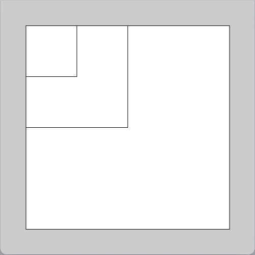
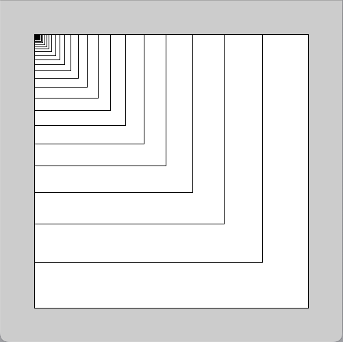
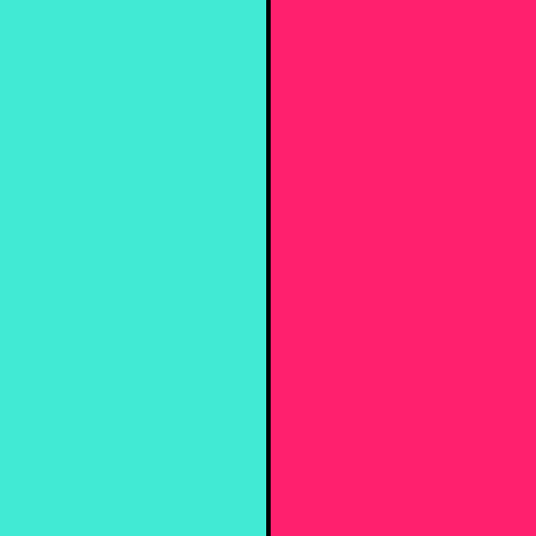
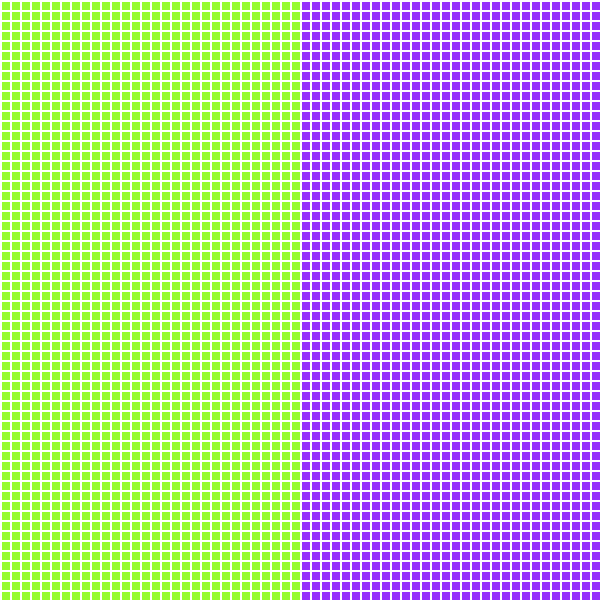
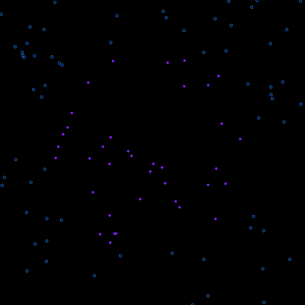
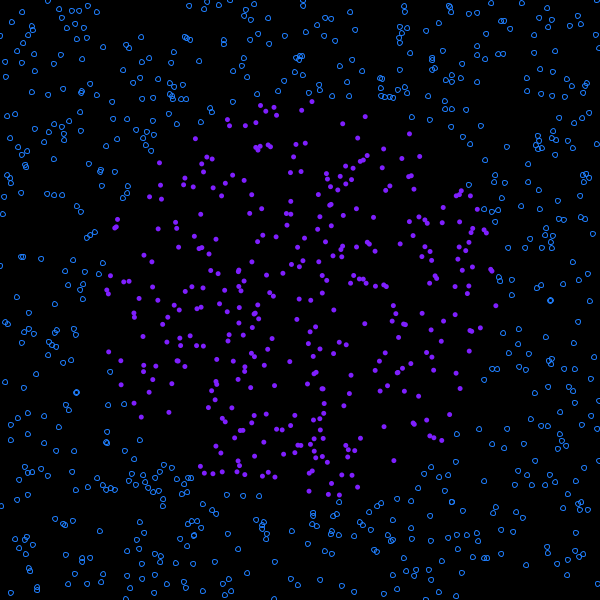
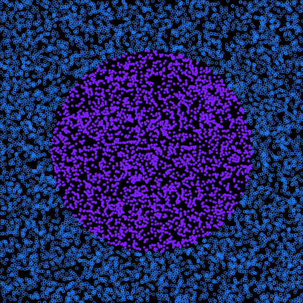
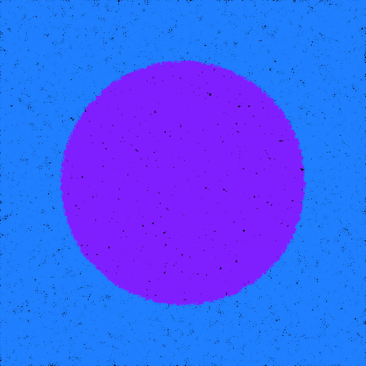

# Computer Graphics

## 第3回： 繰り返し，条件分岐を使った図形描画

情報学部 情報学科 情報メディア専攻
清水 哲也

---

# 今日の内容

1. [変数とデータ型](#sec-variable)
2. [繰り返しによる図形描画](#sec-loop)
3. [条件分岐による図形描画](#sec-branch)
4. [二重ループと格子構造](#sec-grid)
5. [距離と領域による図形表現](#sec-distance)
6. [演習](#sec-exercise)

---

<a id="sec-variable"></a>

<!-- _class: lead -->

# 1．Variables

## 変数とデータ型

---

# 変数とは

変数とは，

> 値を記憶しておくための名前付きの領域

です．

プログラムでは，数値や文字などの値を変数に保存して利用します．

```processing
int rectSize = 400;
```

この例では，`rectSize` という変数に整数値 `400` を保存しています．

---

# 変数を使う理由

変数を使うと，

- 値に名前を付けられる
- 同じ値を何度も利用できる
- 後から値を変更できる
- 図形の位置や大きさを制御できる

という利点があります．

CGでは，変数を使って

```text
位置，大きさ，色，速度，角度
```

などを管理します．

---

# データ型

Processingでは，値の種類に応じて  データ型を使い分けます．

| データ型  |  内容  |         例         |
| --------- | ------ | ------------------ |
| `int`     | 整数   | `10`, `-5`         |
| `float`   | 実数   | `3.14`, `0.5`      |
| `boolean` | 真偽値 | `true`, `false`    |
| `char`    | 文字   | `'A'`              |
| `String`  | 文字列 | `"CG"`             |
| `color`   | 色     | `color(255, 0, 0)` |

---

# 数学的に見る変数

変数は，数学では

$$
x,\ y,\ r,\ \theta
$$

のような記号に近いものです．

ただしプログラムでは，

```processing
x = x + 1;
```

のように，変数の値を更新できます．

これは数学の等式ではなく，

> 右辺を計算して，その結果を左辺に代入する

という命令です．

---

# 代入

```processing
int rectSize = 400;
```

は，

$$
\text{rectSize} \leftarrow 400
$$

と考えることができます．

つまり，

**右辺の値を左辺の変数へ入れる**

という処理です．

---

# 更新

```processing
rectSize = rectSize / 2;
```

は，

$$
\text{rectSize}_{new}
=
\frac{\text{rectSize}_{old}}{2}
$$

という更新です．

例えば，

$$
400 \rightarrow 200 \rightarrow 100 \rightarrow 50
$$

のように値が変化します．

---

# 例題1｜変数を使った図形描画

```processing
size(500, 500);

int rectSize = 400;

rect(50, 50, rectSize, rectSize);
rectSize = rectSize / 2;

rect(50, 50, rectSize, rectSize);
rectSize = rectSize / 2;

rect(50, 50, rectSize, rectSize);
```

`rectSize` の値が変化することで，描画される正方形の大きさが変わります．

---

# 幾何学的な見方

正方形の左上を

$$
(50,50)
$$

一辺の長さを

$$
s
$$

とすると，正方形の領域は

$$
50 \leq x \leq 50+s
$$

$$
50 \leq y \leq 50+s
$$

で表せます．

---

# サイズの数列

先ほどの例では，

$$
s_0=400
$$

$$
s_{n+1}=\frac{s_n}{2}
$$

という規則でサイズが変化します．

したがって，

$$
s_n=400\left(\frac{1}{2}\right)^n
$$

となります．

---

```processing
size(500, 500);

int rectSize = 400;

rect(50, 50, rectSize, rectSize);
rectSize = rectSize / 2;

rect(50, 50, rectSize, rectSize);
rectSize = rectSize / 2;

rect(50, 50, rectSize, rectSize);
```



---

<a id="sec-loop"></a>

<!-- _class: lead -->

# 2．Loops

## 繰り返しによる図形描画

---

# なぜ繰り返しを使うのか

同じ処理を何度も書くと，

- コードが長くなる
- 修正が大変になる
- 回数を間違えやすくなる
- 規則性が見えにくくなる

という問題があります．

そこで，**繰り返し**を使います．

---

# `for`文

Processingでは，繰り返しに `for` 文を使えます．

```processing
for (int i = 0; i < 5; i++) {
  rect(50, 50, rectSize, rectSize);
  rectSize = rectSize / 2;
}
```

これは，

> `i` を0から4まで変化させながら `{ }` の中の処理を5回繰り返す

という意味です．

---

# `for`文の構造

<span class="small">

```processing
for (初期化; 条件式; 更新) {
  繰り返す処理;
}
```

例えば，

```processing
for (int i = 0; i < 5; i++) {
  ...
}
```

この意味は以下のようになる．

|    要素     |       意味       |
| ----------- | ---------------- |
| `int i = 0` | カウンタの初期化 |
| `i < 5`     | 繰り返し条件     |
| `i++`       | 1回ごとの更新    |

</span>

---

# `i++` の意味

```processing
i++;
```

は，

```processing
i = i + 1;
```

と同じ意味です．

数学的には，

$$
i_{new}=i_{old}+1
$$

と考えることができます．

---

# 繰り返しと数列

for文は，数学的には

$$
i=0,1,2,\ldots,N-1
$$

という整数列を生成していると考えられます．

この `i` を利用すると，

- 位置
- 大きさ
- 色
- 角度

を規則的に変化させることができます．

---

# 例題2｜正方形の反復描画

```processing
size(500, 500);

float rectSize = 400;

for (int i = 0; i < 100; i++) {
  rect(50, 50, rectSize, rectSize);
  rectSize = rectSize / 1.2;
}
```

正方形のサイズは，

$$
s_{n+1}=\frac{s_n}{1.2}
$$

に従って小さくなります．

---

# 等比数列として見る

初期値を

$$
s_0=400
$$

とすると，

$$
s_n=400\left(\frac{1}{1.2}\right)^n
$$

です．

これは，**等比数列**です．

CGでは，このような数列を使って  図形の大きさや位置を制御できます．

---

# 減少率

$$
\frac{1}{1.2}\approx0.833
$$

なので，1回ごとにサイズは約83.3%になります．

```text
400
333.3
277.8
231.5
...
```

このように，数式と描画結果が対応します．

---

$$
s_n = 400\left(\frac{1}{1.2}\right)^n
$$



---

# 繰り返しで位置を変える

繰り返し変数 `i` を位置に使うと，  
図形を規則的に並べられます．

```processing
size(600, 200);

for (int i = 0; i < 10; i++) {
  ellipse(50 + i * 50, 100, 30, 30);
}
```

このとき中心座標は，

$$
x_i=50+50i
$$

です．

---

# 等差数列として見る

$$
x_i=50+50i
$$

は，初項50，公差50の等差数列です．

```text
50, 100, 150, 200, ...
```

繰り返しを使うと，

**数列を図形配置へ変換**

できます．

---

# 繰り返しで色を変える

```processing
size(600, 200);

for (int i = 0; i < 10; i++) {
  fill(i * 25);
  ellipse(50 + i * 50, 100, 30, 30);
}
```

この場合，色の明るさは

$$
c_i=25i
$$

として変化します．

---

# CGにおける`for`文

for文は単なるプログラミング構文ではなく，

**規則的な構造を生成する仕組み**

です．

```text
繰り返し変数
  ↓
数列
  ↓
位置・大きさ・色
  ↓
視覚パターン
```

---

<a id="sec-branch"></a>

<!-- _class: lead -->

# 3．Conditional Branch

## 条件分岐による図形描画

---

# 条件分岐とは

条件分岐とは，

> 条件に応じて処理を変える仕組み

です．

Processingでは，

```processing
if (条件式) {
  条件を満たすときの処理
}
```

と書きます．

---

# `if`文

```processing
if (x < 300) {
  fill(90, 80, 99);
}
```

これは，

> もし $x<300$ ならば，色を変更する

という意味です．

数学的には，

$$
x<300
$$

という条件を判定しています．

---

# `if-else`文

```processing
if (x < 300) {
  fill(90, 80, 99);
} else {
  fill(270, 80, 99);
}
```

これは，

$$
x<300
$$

を満たす場合と，満たさない場合で処理を切り替えます．

---

# 条件式

条件式には，**比較演算子**を使います．

| 演算子 |    意味    |
| ------ | ---------- |
| `==`   | 等しい     |
| `!=`   | 等しくない |
| `<`    | より小さい |
| `>`    | より大きい |
| `<=`   | 以下       |
| `>=`   | 以上       |

---

# 条件式は真偽値を返す

条件式の結果は，`true` または `false` です．

例えば，

```processing
x < 300
```

は，`x` の値によって  `true` または `false` になります．

---

# 条件を領域として考える

条件

$$
x<300
$$

は，画面上では **左半分の領域** を表します．

一方，

$$
x\geq300
$$

は，**右半分の領域**です．

条件分岐とは，画面を条件によって分割する操作でもあります．

---



---

# 論理演算子

複数の条件を組み合わせる場合，  
論理演算子を使います．

|          演算子           |   意味   |
| :-----------------------: | -------- |
|           `&&`            | かつ     |
| <code>&#124;&#124;</code> | または   |
|            `!`            | ではない |

---

# AND条件

```processing
if (x > 100 && x < 500) {
  ...
}
```

これは，

$$
100<x<500
$$

という条件を表します．

つまり，**両方の条件を満たすときだけ true**です．

---

# OR条件

```processing
if (x < 100 || x > 500) {
  ...
}
```

これは，

$$
x<100
\quad \text{または} \quad
x>500
$$

を表します．

つまり，**どちらか一方を満たせば true**です．

---

# 条件分岐と集合

条件式は，画面上の点集合を定義します．

例えば，

$$
A=\{(x,y)\mid x<300\}
$$

とすると，これは左半分の領域です．

条件分岐は，

$$
(x,y)\in A
$$

かどうかを判定していると考えられます．

---

<a id="sec-grid"></a>

<!-- _class: lead -->

# 4．Nested Loops

## 二重ループと格子構造

---

# 二重ループ

図形を縦横に並べる場合，`for` 文を2つ組み合わせます．

```processing
for (int y = 0; y < height; y += 10) {
  for (int x = 0; x < width; x += 10) {
    rect(x, y, 8, 8);
  }
}
```

これを**二重ループ**と呼びます．

---

# 格子点として見る

二重ループでは，

$$
x=0,10,20,\ldots
$$

$$
y=0,10,20,\ldots
$$

という2つの数列から，点

$$
(x,y)
$$

を作ります．

これは，画面上の**格子点**です．

---

# 格子構造

格子点は，

$$
(x_i,y_j)
$$

と書けます．

ここで，

$$
x_i=x_0+i\Delta x
$$

$$
y_j=y_0+j\Delta y
$$

です．

二重ループは，このような2次元配列状の点を生成します．

---

# 例題3｜二重for文

```processing
size(600, 600);
background(255);

colorMode(HSB, 360, 100, 100);

int rectSize = 8;

for (int y = 2; y < 600; y += 10) {
  for (int x = 2; x < 600; x += 10) {
    rect(x, y, rectSize, rectSize);
  }
}
```

小さな矩形が画面全体に並びます．

---

# 格子の個数

幅600，高さ600の画面で，10 pixel間隔に矩形を配置すると，

$$
\frac{600}{10}=60
$$

なので，

$$
60\times60=3600
$$

個の矩形が描かれます．

---

# 計算量

二重ループの処理回数は，

$$
N_x\times N_y
$$

です．

例えば，

$$
N_x=60,\quad N_y=60
$$

なら，

$$
3600
$$

回処理されます．

CGでは，繰り返し回数が多いほど描画処理の負荷も大きくなります．

---

# 条件分岐を追加する

左半分と右半分で色を変えるには，

```processing
if (x < width / 2) {
  fill(90, 80, 99);
} else {
  fill(270, 80, 99);
}
```

を使います．

境界は，

$$
x=\frac{width}{2}
$$

です．

---

<!-- _class: no-footer -->

# 例題4｜二重ループと条件分岐

```processing
size(600, 600);
background(255);
noStroke();
colorMode(HSB, 360, 100, 100);

int rectSize = 8;

for (int y = 2; y < height; y += 10) {
  for (int x = 2; x < width; x += 10) {
    if (x < width / 2) {
      fill(90, 80, 99);
    } else {
      fill(270, 80, 99);
    }
    rect(x, y, rectSize, rectSize);
  }
}
```

---

# 条件分岐による画面分割

このプログラムでは，画面を

$$
x<\frac{width}{2}
$$

と

$$
x\geq\frac{width}{2}
$$

に分けています．

つまり，条件分岐によって画面を2つの領域に分割しています．

---



---

<a id="sec-distance"></a>

<!-- _class: lead -->

# 5．Distance & Region

## 距離と領域による図形表現

---

# `dist`関数

Processingでは，2点間の距離を

```processing
dist(x1, y1, x2, y2);
```

で求められます．

数学的には，

$$
d=
\sqrt{(x_2-x_1)^2+(y_2-y_1)^2}
$$

です．

これは**ユークリッド距離**です．

---

# 画面中心からの距離

点

$$
P=(x,y)
$$

と画面中心

$$
C=\left(\frac{width}{2},\frac{height}{2}\right)
$$

の距離は，

$$
d=
\sqrt{
\left(x-\frac{width}{2}\right)^2
+
\left(y-\frac{height}{2}\right)^2
}
$$

です．

---

# 距離による条件分岐

```processing
if (d < 200) {
  ...
} else {
  ...
}
```

は，

$$
d<200
$$

を満たす点と，満たさない点で  処理を変えています．

これは，**円の内側と外側を分ける条件**です．

---

# 円領域として見る

中心を$C=(c_x,c_y)$，半径を$r$とすると，

円の内部は

$$
(x-c_x)^2+(y-c_y)^2<r^2
$$

で表されます．

`dist()` は，この判定を直感的に書くための関数です．

---

<!-- _class: no-footer -->

# 例題5｜距離による図形描画

```processing
size(600, 500);
background(0);
noStroke();

int num = 1000;

for (int i = 0; i < num; i++) {
  float x = random(0, width);
  float y = random(0, height);
  float d = dist(x, y, width/2, height/2);

  if (d < 200) {
    noStroke();
    fill(127, 31, 255);
  } else {
    noFill();
    stroke(31, 127, 255);
  }
  ellipse(x, y, 5, 5);
}
```

---

# `random`関数

```processing
random(0, width);
```

は，

$$
0 \leq x < width
$$

の範囲からランダムに実数を生成します．

同様に，

$$
0 \leq y < height
$$

の範囲から $y$ を生成します．

---

# ランダムサンプリング

このプログラムでは，画面上の点をランダムに選んでいます．

$$
(x,y)\sim U([0,width)\times[0,height))
$$

と考えることができます．

ここで $U$ は**一様分布**を表します．

---

# 点の数と見え方

変数 `num` を増やすと，ランダムに配置される点の数が増えます．

```processing
int num = 100;
int num = 1000;
int num = 10000;
```

点の数が増えるほど，  
距離条件による領域の形が明確になります．

---

# 確率的な図形描画

この例では，円を直接描いているわけではありません．

ランダムに選んだ点に対して，

$$
d<200
$$

という条件を判定することで，  
円形の領域が浮かび上がります．

これは，**確率的に図形を描く**考え方です．

---

|             `num = 100`              |             `num = 1000`              |
| :----------------------------------: | :-----------------------------------: |
|  |  |

---

|             `num = 10000`              |             `num = 100000`              |
| :----------------------------------: | :-----------------------------------: |
|  |  |

---

# HSBと距離

距離 $d$ を色に使うと，中心から外側に向かって色を変化させられます．

例えば，

$$
Hue = d
$$

のようにすれば，距離に応じて色相が変わります．

```processing
colorMode(HSB, 360, 100, 100);
fill(d % 360, 80, 100);
```

---

# 距離によるグラデーション

```processing
float d = dist(x, y, width/2, height/2);
float h = map(d, 0, 300, 0, 360);

fill(h, 80, 100);
```

`map()` を使うと，

$$
d\in[0,300]
$$

を

$$
h\in[0,360]
$$

へ変換できます．

---

# `map`関数

```processing
map(value, start1, stop1, start2, stop2);
```

は，線形変換です．

数学的には，

$$
y
=
start2
+
\frac{value-start1}{stop1-start1}
(stop2-start2)
$$

です．

CGでは，値の範囲を変換するときによく使います．

---

<a id="sec-exercise"></a>

<!-- _class: lead -->

# 6．Exercise

## 演習

---

# 演習1｜等差数列による配置

次の条件で円を描いてください．

- 画面サイズ：$600\times200$
- 円の数：10個
- 円の直径：30
- $x$ 座標は等間隔
- $y=100$

中心座標を

$$
x_i=50+50i
$$

として配置してください．

---

# 演習2｜等比数列によるサイズ変更

次の条件で正方形を描いてください．

- 画面サイズ：$600\times600$
- 左上座標：$(50,50)$
- 初期サイズ：500
- 1回ごとにサイズを0.85倍
- 繰り返し回数：30回

サイズを

$$
s_n=500(0.85)^n
$$

として考えてください．

---

# 演習3｜条件分岐による領域分割

画面を3つの領域に分け，矩形の色を変えてください．

- 左領域：赤系
- 中央領域：緑系
- 右領域：青系

ヒント：

$$
x<\frac{width}{3}, \ \frac{width}{3}\leq x<\frac{2width}{3}, \ 
x\geq\frac{2width}{3}
$$

---

# 演習4｜距離による領域表現

ランダムな点を描き，

中心からの距離によって色を変えてください．

- 中心から近い点：明るい色
- 中心から遠い点：暗い色

さらに，

$$
d<150
$$

$$
150\leq d<250
$$

$$
250\leq d
$$

の3領域に分けてください．

---

<!-- _class: lead -->

# Summary

## 今日のまとめ

---

# 今日の重要ポイント

## 変数

値を保存し，図形の状態を制御する．

## 繰り返し

規則的な図形配置を生成する．

## 条件分岐

画面上の領域に応じて処理を変える．

---

# 数学との対応

| プログラム |    数学的な見方    |
| ---------- | ------------------ |
| 変数       | 値・状態           |
| `for`      | 数列               |
| 二重ループ | 格子点             |
| `if`       | 条件・領域         |
| `dist()`   | ユークリッド距離   |
| `random()` | 確率的サンプリング |
| `map()`    | 線形変換           |

---

# CG表現としての意味

今日の内容は，単なるプログラミング文法ではありません．

```text
変数
  ↓
数列
  ↓
条件
  ↓
領域
  ↓
図形パターン
```

という流れで，プログラムから視覚表現を生成しています．

---

# 次回

## アニメーションの基本 I

次回は，

- `setup()`
- `draw()`
- フレーム
- 時間変化
- 動きの実装

を扱います．

静止した図形から，時間によって変化するCGへ進みます．